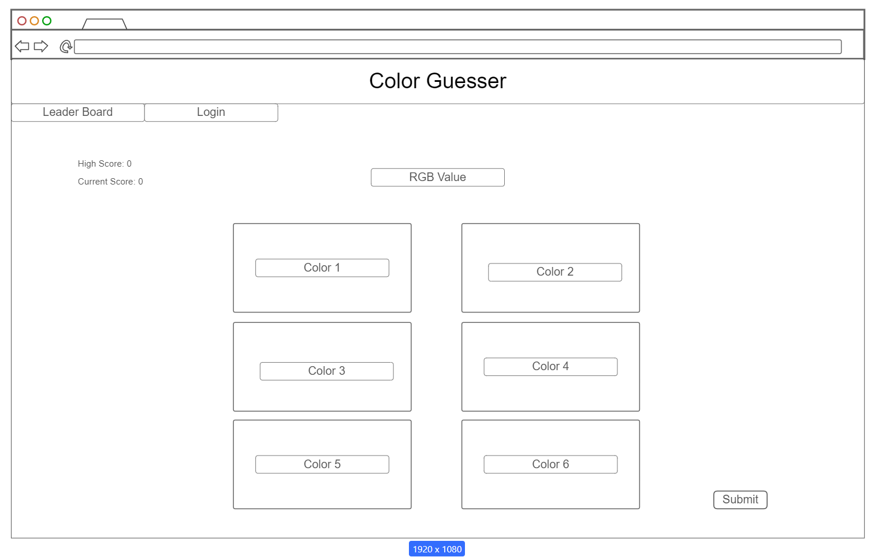

# Color Guesser
## Elevator Pitch
Did you know that there are over 16 million different color combinations using just red, green, and blue?! Some of these combinations are so close it can get very hard for the human eye to spot the difference, and that is what this game is testing! Multiple frames will be shown of different colors, and the color combination of the one you are looking for will be at the top. It is your job to determine which colored frame matches the color combination listed. If you are correct you get a point, but if you fail your game starts over. The people with the highest scores will be displayed on the leaderboard.

## Design

## Key Features
* Secure login over HTTPS
* Display of Current Score
* Display of High Score
* Ability to see leaerboards that display usernames with the highest scores
* Highscore is stored for profile
* Ability to randomly generate an RGB value and display it
* Ability to display 6 randomly generated color values
* Auto Reset of current score when getting a guess wrong
* Ability to select and submit one color
* Increment score if color selected matches above RGB Value

## Technologies
* **HTML** - 4 HTML pages. One for login. One for the game. One for leaderboard. Good HTML structure.
* **CSS** - Making sure the color scheme and contrast is good. Aslo to make sure the application can fit on different screen sizes.
* **JavaScript** - Adding functions to buttons, and randomizing different color values. It also provides login
* **React** - This handles login and routing
* **Service** - This handles the backend for
  * submitting color selection
  * Retrieving if color selection is correct
  * login
* **DB/Login** - This will store and display player highscores. Displays User name when logged in.
* **WebSocket** - This will show the leaserboards of other player's scores.

# Deliverables
## HTML Deliverable
I built the sturcture to my website using HTML
* **HTML Pages** - Four HTML pages representing login, play, high Scores, and about
* **Links** - Each page links to all the other pages
* **Text** - The about section explains how to play the game
* **Images** - Included image in home and image for web icon
* **Login** - Input box and submit button for login. Option for guest.
* **WebSocket** - Display table for Global High scores.

## CSS Deliverable
For this deliverable I properly styled the application into its final appearance
* **Header, Footer, and main content Body** - Properly implemented the styling for these elements.
* **Nav Elements** - I dropped the blue underline and mad the whole color of the element cyan with also changing the color when hovering over it.
* **Responsive to Window Resizing** - My application responds to window resizing and looks good on all platforms.
* **Application Elements** - I implemented a grid element for the scores page, and implemented good contrast.
* **Application Text Content** - Consistent fonts and font color. Also changed color of some text and underlined some parts.
* **Application Images** - Curved the edges of the images and added shadows to make them fit in

## React Deliverable
The application now works for a single user minus persistant storage.
* **Bundled and Transpiled** - This was done using Vite
* **Components** - I added functionality to color game, and mocked login and set up for websocket
  * **Login** - Cannot be left empty, and added guest feature functionality
  * **database** - Created temporary instances of variables that will eventually be stored in the database.
  * **websocket** - mocked it so when it is added it can be easily included.
  * **aplication logic** - Made game functional with random color changes and scoring system
*  **Router** - Added router functioanlity to route between different pages without reloading.
*  **Hooks** - Added states, instances, and effects to create functioanlity.

## Service Deliverable
For this deliverable I added backend endpoints that receives the scores and displays the highest ones.

* **Node.js/Express HTTP service** - done.
* **Static middleware for frontend** - done.
* **Calls to third party endpoints** - I called a quote generator in about section.
* **Backend service endpoints** - Added endpoints for scores and placeholders for logging in.
* **Frontend calls service endpoints** - Done using the fetch function.

## DB/Login deliverable
For this deliverable I stored encrypted login info in database as well as scores associated with the user.

* **MongoDB Atlas database created** - done.
* **Stores data in MongoDB** - done, stores login info, scores, and auth.
* **User registration** - Creates a new account in the database.
* **existing user** - Returns an error if user already exists in the db.
* **Use MongoDB to store credentials** - Stores both encrypted user info and their scores.
* **Restricts functionality** - You can only play when logged in. An authtoken stored in the cookie is need to play.
